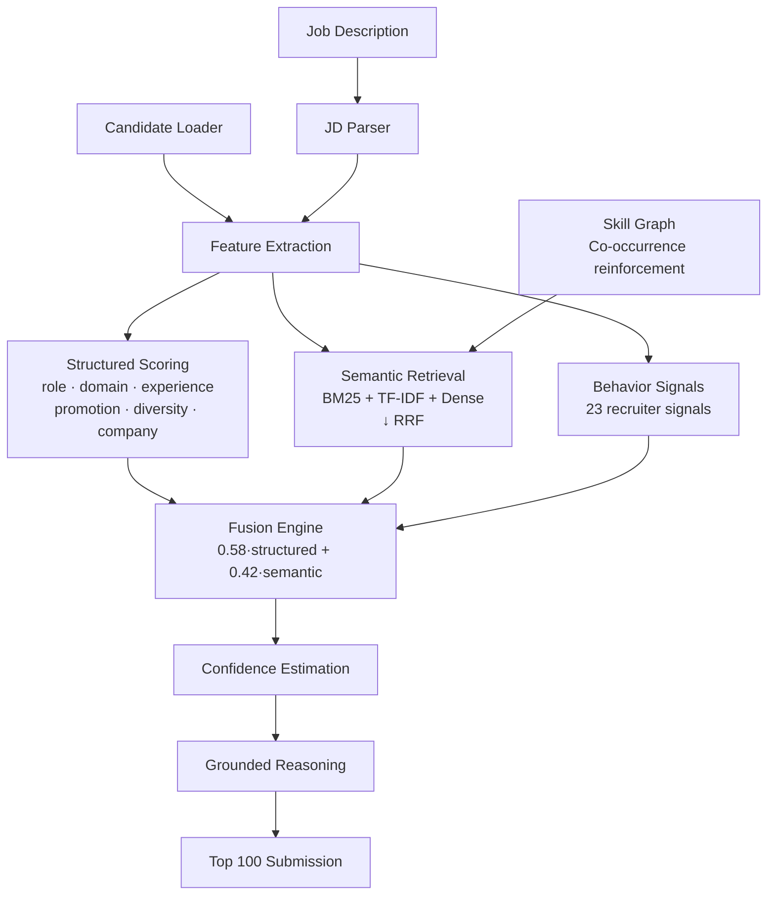

<div align="center">

# Intelligent Candidate Discovery Engine


Production-grade hybrid candidate ranking system built for the **India Runs Data & AI Challenge**. The engine combines structured reasoning, semantic retrieval, behavioral intelligence, and explainable AI to identify the most relevant candidates while preventing keyword stuffing and honeypot profiles.

</div>

---

## Problem Statement

Modern Applicant Tracking Systems rely heavily on keyword matching, making them vulnerable to keyword stuffing, misleading profiles, and poor semantic understanding. This project introduces a hybrid retrieval and ranking pipeline that combines structured profile analysis, semantic search, recruiter behavioral intelligence, and explainable scoring to identify high-quality candidates accurately - all **CPU-only, fully offline, and under 5 minutes**.

---

## Key Features

| | | |
|---|---|---|
| **Hybrid Retrieval** - BM25 + TF-IDF + Dense fused via RRF | **Explainable AI** - Grounded, hallucination-free reasoning only | **JD Intelligence** - Automatic requirement extraction from any JD |
| **Behavior Intelligence** - 23 recruiter signals weighted dynamically | **Honeypot Detection** - Internal-consistency verification with 0 false positives | **Skill Graph** - Co-occurrence-based relationship-aware matching |
| **Confidence Scoring** - Trust estimation per candidate | **Offline** - No external APIs, no model downloads | **Rejection Analysis** - Categorized why-not for every candidate |

---

## Architecture



---

## How It Works

1. **Load candidates** - Stream 100,000 JSONL records with transparent gzip support
2. **Understand JD** - Parse job description into required skills, preferred skills, disqualifiers, location, experience band, behavioral traits
3. **Build Skill Graph** - Compute co-occurrence matrix from the candidate pool for related-skill reinforcement
4. **Extract Features** - 9-dimensional structured scoring: role, domain, product, experience, external, location, promotion trajectory, project diversity, company quality
5. **Semantic Retrieval** - Multi-channel BM25 + TF-IDF + optional dense embeddings fused via weighted Reciprocal Rank Fusion (RRF)
6. **Behavioral Weighting** - Modifier [0.55, 1.12] from 8 recruiter signals: recency, response rate, open-to-work, interview completion, offer acceptance, notice period, engagement
7. **Honeypot Detection** - 3 calibrated consistency checks with 0 false positives; flagged profiles gated by 0.02x multiplier
8. **Confidence Estimation** - [0, 1] score from signal completeness, semantic-structured agreement, pool position, behavioral certainty
9. **Grounded Reasoning** - Hallucination-free 1-2 sentence justification assembled from candidate's real fields
10. **Generate output** - `submission.csv` (top 100) + `{out}_rejected.jsonl` (categorized why-not for remaining 99,900) + `{out}_debug.json` (weight breakdown)

---

## Results

| Metric | Value |
|---|---|
| Candidates processed | 100,000 |
| Wall-clock runtime | 263 s (~4.4 min) |
| Memory | ~1.5 GB RAM |
| CPU-only | ✅ |
| Network required | ❌ |
| Honeypots flagged | 46 |
| Honeypots in top 100 | **0** |
| Model downloads | None (optional dense path) |
| Output format | `submission.csv` |

---

## Innovation

| Traditional ATS | This Project |
|---|---|
| Keyword matching | **Hybrid retrieval** - BM25 + TF-IDF + Dense → RRF |
| Static rules | **Adaptive JD parser** - generalizable to any role |
| Single signal | **9-dimensional structured fit** incl. promotion, diversity, company quality |
| No explainability | **Explainable AI** - grounded, hallucination-free reasoning |
| Ignores behavior | **Behavioral intelligence** - 23 recruiter signals |
| No validation | **Honeypot detection** - internal-consistency verification |
| One retriever | **Multi-channel** - BM25 (primary) + TF-IDF (secondary) + Dense (optional) |
| No rejection feedback | **Why-rejected storage** - 10 categories with confidence scores |

---

## Repository Structure

```
.
├── src/
│   ├── config.py          # Weights, taxonomy, company categories, JD config
│   ├── features.py        # 9-dim structured fit, honeypot, confidence
│   ├── pipeline.py        # Orchestration, fusion, CSV writer
│   ├── reasoning.py       # Grounded justifications, rejection reasons
│   ├── text_channel.py    # BM25 + TF-IDF + Dense → RRF
│   ├── jd_parser.py       # JD requirement extraction
│   ├── skill_graph.py     # Co-occurrence knowledge graph
│   ├── loading.py         # JSONL/gz streaming
│   ├── dates.py           # Date helpers
│   └── __init__.py
├── scripts/
│   ├── eda.py             # Honeypot calibration + role landscape
│   └── precompute_embeddings.py  # Optional model2vec artifact
├── tests/
│   └── test_smoke.py      # 14 behavioural smoke tests
├── sandbox/
│   └── app.py             # Streamlit demo
├── artifacts/             # Precomputed dense embeddings (optional)
├── rank.py                # CLI entry point
├── pyproject.toml         # Poetry build config
├── requirements.txt       # pip dependencies
└── README.md
```

---

## Installation

```bash
git clone <repo-url> && cd India-Runs
pip install -r requirements.txt
OR
poetry install
```

---

## Usage

```bash
# Full ranking (100k candidates → top 100)
python rank.py \
  --candidates candidates.jsonl \
  --out submission.csv

# Custom job description (adaptable to any role)
python rank.py \
  --candidates candidates.jsonl \
  --jd jd.txt \
  --out submission.csv

# Quick validation (top 10)
python rank.py \
  --candidates candidates.jsonl \
  --top-n 10 \
  --out top10.csv

# With precomputed dense embeddings
python scripts/precompute_embeddings.py \
  --candidates candidates.jsonl
python rank.py \
  --candidates candidates.jsonl \
  --dense artifacts/dense_embeddings.npz

# Validate output
python validate_submission.py submission.csv
```

---

## Example Output

| Rank | Candidate | Score | Confidence | Reasoning |
|---|---|---|---|---|
| 1 | Senior ML Engineer | 1.000 | 0.98 | Career history shows production retrieval/ranking work. Shows career progression. Broad experience across retrieval, ranking, LLM, evaluation, production. Active this month, high recruiter response (0.61), GitHub activity 95. |
| 2 | Lead AI Engineer | 0.980 | 0.97 | Strong fit with vector search and retrieval. Promotion trajectory. Broad experience. Active, high response rate (0.73), GitHub 34. |
| 3 | Senior ML Engineer | 0.951 | 0.96 | Production retrieval/ranking work. Broad experience. Active, high response (0.88), GitHub 37. |

---

## Tech Stack


---

## Run Tests

```bash
python tests/test_smoke.py
# 14/14 smoke tests pass